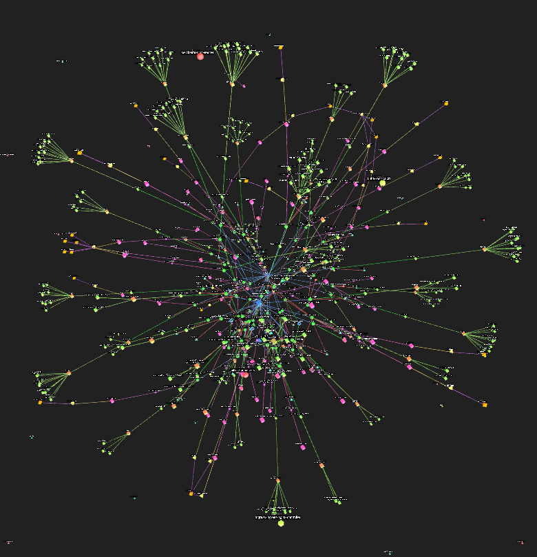
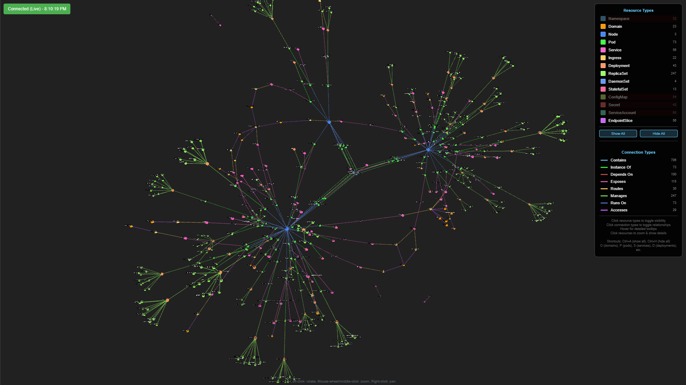
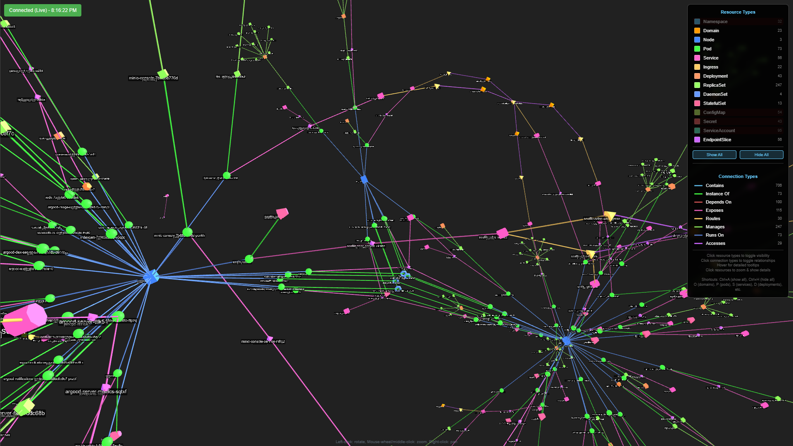
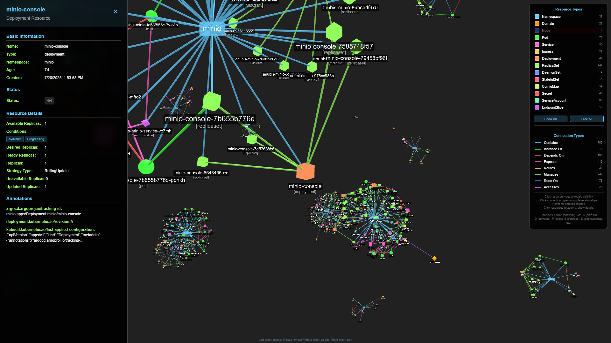
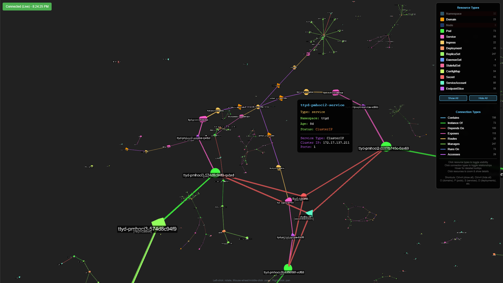

<div align=center>



# kube-universe (improved)

</div>

## Overview

Kube-Universe renders a Kubernetes cluster into a dynamic 3D graph.

## Try it now!!
A __Live Demo Version__ is available [here](https://visualized.pmh.codes)

## Gallery
> you can enlarge the image by clicking on it

https://github.com/user-attachments/assets/b765eab7-0850-4d29-8b5b-2a2e39a8a681

| [](docs/gallery1.png) | [](docs/gallery2.png) |
| :--: | :--: |
| [](docs/gallery3.png) | [](docs/gallery4.png) |

## Features

* 3D cluster overview with comprehensive Kubernetes resource visualization
* Real-time updates via WebSocket connection
* Identify pods with errors and status information
* Visual representation of resource relationships and dependencies

## Supported Resource Types

* **Core Resources**: Namespaces, Pods, Nodes, Services, ConfigMaps, Secrets, ServiceAccounts
* **Workload Resources**: Deployments, ReplicaSets, DaemonSets, StatefulSets
* **Network Resources**: Ingresses, EndpointSlices
* **Visual Indicators**: Different shapes and colors for each resource type
* **Status Information**: Pod status, deployment replica counts, and more

## Installation and Usage

Try `kube-universe` with Kubernetes Manifest file

```sh
kubectl apply -f https://raw.githubusercontent.com/pmh-only/kube-universe/master/docs/deploy_full.yaml
kubectl port-forward -n kube-universe svc/kube-universe-service 3000:3000
```

and open http://127.0.0.1:3000 in your browser

## Development

To build and run `kube-universe` from source

```sh
statik -f -src=./web/
go run main.go serve
```

## Acknowledgements

* Kube universe is using [3d-force-graph](https://github.com/vasturiano/3d-force-graph) for rendering.
* This is a friendly fork of [kube-universe by afritzler](https://github.com/afritzler/kube-universe).
